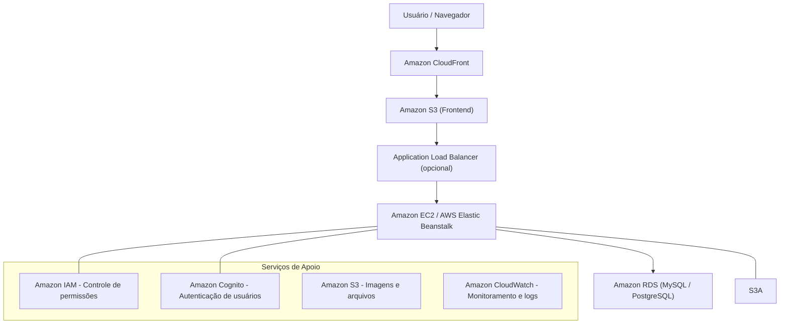

# Plataforma Farmácia Virtual na AWS

Plataforma virtual de uma **farmácia fictícia** desenvolvida sobre a infraestrutura da **Amazon Web Services (AWS)**, com foco em boas práticas de arquitetura em nuvem, escalabilidade, segurança e alta disponibilidade.  
Projeto voltado para fins **acadêmicos e de portfólio técnico**.

---

## 📖 Visão Geral
_A aplicação simula um sistema de e-commerce farmacêutico, contemplando:_
- Autenticação de usuários  
- Catálogo de produtos  
- Carrinho de compras  
- Processamento de pedidos  
- Painel administrativo  
A solução aplica conceitos reais de computação em nuvem por meio de uma arquitetura em camadas utilizando serviços gerenciados da AWS.

---

## 🏗️ Diagrama de Arquitetura

## 🏗️ Arquitetura da Solução
A plataforma é composta por três camadas principais:
1. Frontend (Apresentação):
- Amazon S3 (Static Website Hosting)
- Amazon CloudFront (CDN)

2. Backend (Aplicação):
- Amazon EC2 ou AWS Elastic Beanstalk
- API REST (Node.js, Python ou Java)

3. Banco de Dados (Dados):
- Amazon RDS (MySQL ou PostgreSQL)

4. Segurança e Gerenciamento:
- AWS IAM, Security Groups e VPC
- HTTPS via CloudFront ou Load Balancer

5. Monitoramento:
- Amazon CloudWatch

## 🚀 Tecnologias Utilizadas
- Frontend: HTML5, CSS3, JavaScript (ou React)
- Backend: Node.js / Python (Flask, Django) / Java (Spring Boot)
- Banco de Dados: MySQL ou PostgreSQL (Amazon RDS)
- Infraestrutura: AWS (EC2, S3, RDS, CloudFront, IAM, VPC, CloudWatch)

## ⚙️ Funcionalidades
- Cadastro e autenticação de usuários
- Listagem e busca de produtos
- Carrinho de compras
- Finalização de pedidos
- Administração de produtos e pedidos

## 🛠️ Implantação na AWS (Resumo)
1. Criar uma VPC com sub-redes públicas e privadas
2. Provisionar o Amazon RDS em sub-rede privada
3. Criar o Backend em EC2 ou Elastic Beanstalk
4. Hospedar o Frontend no Amazon S3
5. Configurar o CloudFront para distribuição global
6. Definir segurança com IAM e Security Groups
7. Ativar monitoramento com CloudWatch
8. O roteiro detalhado de implantação encontra-se na documentação do projeto.

## 🔐 Segurança
- Acesso ao banco restrito apenas às instâncias da aplicação
- Permissões mínimas com IAM Roles
- Comunicação criptografada via HTTPS
- Monitoramento contínuo com CloudWatch

## 📊 Monitoramento
- Métricas de CPU, memória e rede
- Logs da aplicação
- Alarmes configuráveis para incidentes
